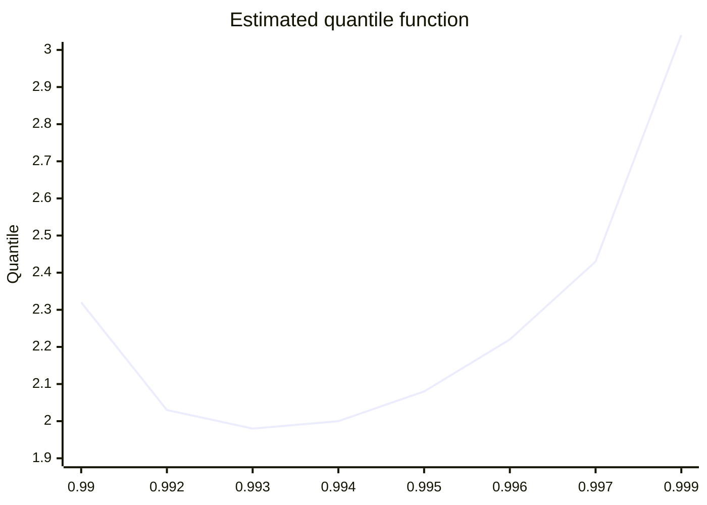

# #62 - Quadratic quantile interpolator does not guarantee monotonicity [Open]

> Username: adimajo  
> Created at: 2024-04-16 08:08:20 UTC  
> Updated at: 2024-04-16 08:31:19 UTC  
> Url: https://github.com/boostorg/accumulators/issues/62  

In `[weighted_][extended_]p_square.hpp`, the p-square algorithm (an online - in the sense that it doesn't require storing all samples - quantile estimator) is implemented. Additionally:  
* a weighted version (that is, incoming samples are given a weight) is provided  
* an extended version (which allows the estimation of several quantiles) is provided.  
  
The extended version also introduces the ability to use *interpolation*:  
* Suppose an accumulator set for `[weighted_]extended_p_square_quantile` is instantiated with requested quantiles `{0.001, 0.2, 0.5, 0.8, 0.999}`  
* Internally, the accumulator set (implementing the p-square algorithm) actually estimates the following quantiles: `{0, 0.0005, 0.001, ~0.1, 0.2, 0.35, 0.5, 0.65, 0.8, ~0.9, 0.999, 1}` where quantiles 0 (resp. 1) corresponds to the min (resp. max) value seen, and values not present in requested quantiles are mid-points between requested quantiles.  
* Independently from this implementation detail, the `boost::accumulators::quantile` method can be used with this accumulator set to extract a desired quantile estimate.  
* If this desired quantile corresponds to a requested quantile, it is obviously directly returned.  
* If not, then depending on the accumulator set's constructor's parameters, a linear or quadratic interpolation is provided.  
  
Unfortunately, the computation of the quadratic interpolator polynomial does not incorporate a mechanism to enforce monotonicity such that it is possible/likely to get a mathematically incoherent quantile function, *i.e.* a an estimated quantile function such that $`\exists \; 0 < i < j < 1 \; | \; \hat{q}(i) > \hat{q}(j)`$.  
  
To illustrate this claim, the programs   
[`MWE3(_4).{cpp,py}`](https://github.com/boostorg/accumulators/files/14990518/MWE3.zip) do the following:  
  
* Instanciate an accumulator_set of type weighted_extended_p_square_quantile with quadratic interpolation and give it quantiles to track `{0.99, 0.999, 0.9999}`.  
* Do 10000 times:  
    * Draw a sample from standard normal distribution $\mathcal{N}(0, 1)$.  
    * Estimate quantiles `{0.99, 0.992, 0.993, 0.994, 0.995, 0.996, 0.997, 0.999}`.  
* Plot the estimates: estimates should obviously be monotonically increasing.  
  
  
Schematically, for the final values, in the quantile function space, this gives:  
  

  
This phenomenon appears because the last point participating in the quadratic interpolation polynomial, namely 0.9999 is close to 0.999 but the quantiles are far apart, such that the "convexity" required to go through all three points is high.  
  
Since this makes no mathematical sense, I would either issue a strong warning at instantiation or deprecate this interpolator. If an additional interpolator (w.r.t. the linear one) is needed, I would suggest looking into integrating splines which monotonicity can be enforced (see *e.g.* https://github.com/ttk592/spline/).  
  
Notes:  
* Program MWE3 can be compiled e.g. via: `g++ -I$BOOST_INCLUDE_PATH MWE3.cpp -o MWE3`  
* Data is generated via `MWE3 > data3.csv`  
* Plots are generated via `python3 MWE3_4.py 3`  
* `MWE3.py` requires `matplotlib` and `pandas`
