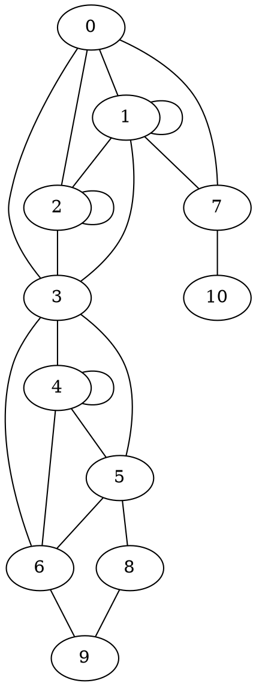

# #328 - Semantic problem in articulation_points [Closed]

> Username: hoehrmann  
> Created at: 2023-03-12 00:59:31 UTC  
> Updated at: 2023-03-12 01:06:36 UTC  
> Closed at: 2023-03-12 01:06:36 UTC  
> Url: https://github.com/boostorg/graph/issues/328  

Boost BGL reports vertices 4 and 7 as articulation points in this graph:  
  

  
Python's networkx library reports 3 and 7:  
  
```python  
>>> list(networkx.articulation_points(networkx.Graph([(0, 1),  
(0, 2), (0, 3), (0, 7), (1, 1), (1, 2), (1, 3), (1, 7), (2, 2), (2, 3), (3, 4),  
(3, 5), (3, 6), (7, 10), (4, 4), (4, 5), (4, 6), (5, 6), (5, 8), (6, 9), (8, 9)])))  
[3, 7]  
```  
  
[Looking at the graph](https://dreampuf.github.io/GraphvizOnline/#graph%20%22%22%20%7B%0A0%20--%201%3B%0A0%20--%202%3B%0A0%20--%203%3B%0A0%20--%207%3B%0A1%20--%201%3B%0A1%20--%202%3B%0A1%20--%203%3B%0A1%20--%207%3B%0A2%20--%202%3B%0A2%20--%203%3B%0A3%20--%204%3B%0A3%20--%205%3B%0A3%20--%206%3B%0A7%20--%2010%3B%0A4%20--%204%3B%0A4%20--%205%3B%0A4%20--%206%3B%0A5%20--%206%3B%0A5%20--%208%3B%0A6%20--%209%3B%0A8%20--%209%3B%0A%7D%0A) it seems clear that removing vertex 4 does not increase the number of connected components, contrary to the definition of an articulation point (»Articulation points are vertices whose removal would increase the number of connected components in the graph.« in the Boost BGL documentation).

---

## Comment 1

> Username: hoehrmann  
> Created at: 2023-03-12 01:05:47 UTC  
> Url: https://github.com/boostorg/graph/issues/328#issuecomment-1465062655  

My bad.
