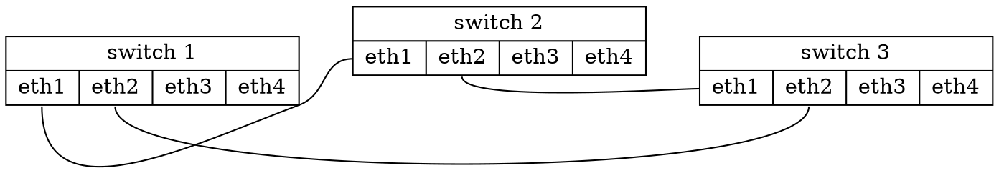

# #419 - Pass port information to BGL [Open]

> Username: mestag-a  
> Created at: 2025-02-14 13:31:05 UTC  
> Updated at: 2025-08-24 20:34:58 UTC  
> Url: https://github.com/boostorg/graph/issues/419  

I read in section "Future Work" of [`boost::read_graphviz()`](https://www.boost.org/doc/libs/1_87_0/libs/graph/doc/read_graphviz.html):  
> - Passing port information to BGL.  
> [...]  
  
I couldn't find any related ongoing work on Github:  
- Is someone working on this already?  
- Is this still something that BGL would want to implement?  
  
I would be interested in the feature, and I would even be interested in implementing it myself if nothing's already being done. That being said, I have zero familiarity with boost's code base, so I'd be interested in getting some pointers as to how you would like to get it done.  
  
With ports, I understand that edges now connect ports, and not nodes... Plus, ports are optional, so we'd need to have a default one. Without being familiar with the code base, I guess this change will require a not-so-small patch.  
  
As for the use case, (IMO) it's especially useful to draw network layouts (with information like "which port of device X is connected to which port of device Y").  
  

  

---

## Comment 1

> Username: jeremy-murphy  
> Created at: 2025-02-15 09:20:00 UTC  
> Url: https://github.com/boostorg/graph/issues/419#issuecomment-2660835646  

Ahh, interesting. I'm not sure how ports would be modelled in BGL at the moment, but I'm sure we can find a way. Would have to be seamless for the users that aren't interested in ports, of course.   
I'm not sure where to point you at the moment... I guess have a look through the implementation of `adjacency_list` to see how multiple edges are currently implemented... which, off-the-cuff, is much like an ordinal tree is implemented... but ports means the ability to enumerate and have null ports, much like a cardinal tree... hmmm, curious. I did actually encounter this kind of issue when I implemented a binary tree for Boost. So it might be a matter of specifying the EdgeList as a statically-sized data structure.

---

## Comment 2

> Username: Becheler  
> Created at: 2025-08-24 20:34:58 UTC  
> Url: https://github.com/boostorg/graph/issues/419#issuecomment-3218361637  

Sorry for my naivety, but would it be possible to extend Boost’s Graphviz reader to capture endpoint ports and store them in edge bundles/property maps, and optionally update the writer to re-emit `:port` when present ?  
  
Something along these lines maybe ? The changes would be contained in the I/O layer with no impact on algoriithms.  
  
https://godbolt.org/z/M81j6z5dv  
  
Just my 2 cents :)
