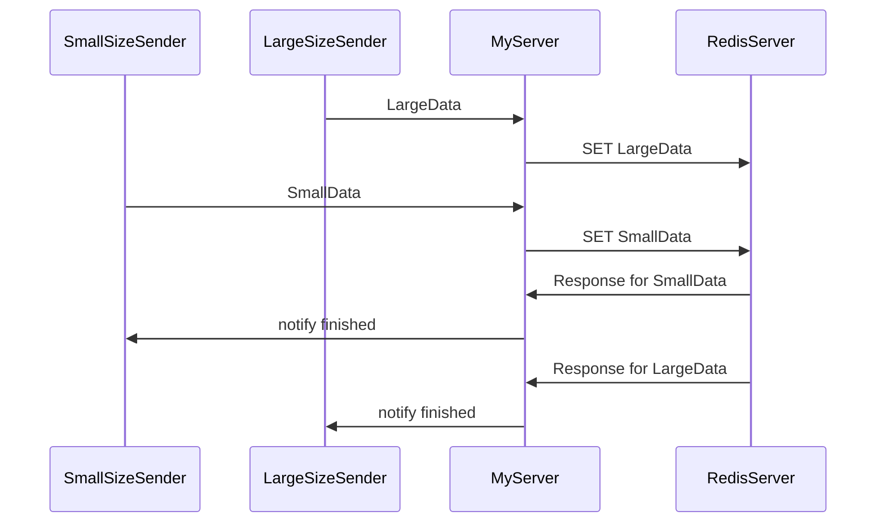
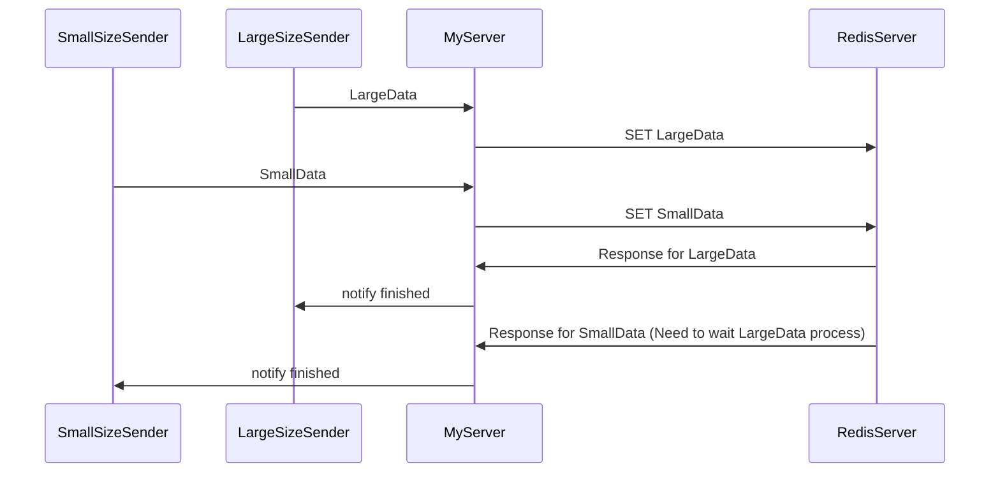

# #178 - Are distinct connection objects thread safe ? [Closed]

> Username: redboltz  
> Created at: 2024-01-11 13:36:31 UTC  
> Updated at: 2024-02-18 21:08:02 UTC  
> Closed at: 2024-02-18 21:08:01 UTC  
> Url: https://github.com/boostorg/redis/issues/178  

# Overview  
Boost version is 1.84.0.  
  
It seems that the same object of `connection` from multiple threads is not safe. It is OK.  
I create multiple `connection` object per co_spawned function (proc()). And io_context is running on multiple threads.  
  
NOTE: io_context is thread safe. See:  
 [Thread Safety](https://www.boost.org/doc/libs/1_84_0/doc/html/boost_asio/reference/io_context.html#boost_asio.reference.io_context.thread_safety)  
> Distinct objects: Safe.  
>   
> Shared objects: Safe, with the specific exceptions of the restart() and notify_fork() functions. Calling restart() while there are unfinished run(), run_one(), run_for(), run_until(), poll() or poll_one() calls results in undefined behaviour. The notify_fork() function should not be called while any [io_context](https://www.boost.org/doc/libs/1_84_0/doc/html/boost_asio/reference/io_context.html) function, or any function on an I/O object that is associated with the [io_context](https://www.boost.org/doc/libs/1_84_0/doc/html/boost_asio/reference/io_context.html), is being called in another thread.  
  
I wrote the following code. When I set `num_of_threads = 1`. All tasks and steps are finished expectedly. However, when I increase `num_of_threads`, then weired behavior happened.  See Output.  
  
I think that even if `num_of_threads` is increased, the program should finish correctly (SET all key-value and finish).  
  
# Minimal reproduce code  
  
```cpp  
#include <iostream>  
#include <syncstream>  
#include <atomic>  
#include <thread>  
#include <vector>  
  
#include <boost/asio.hpp>  
#include <boost/redis/src.hpp>  
  
namespace asio = boost::asio;  
namespace redis = boost::redis;  
  
constexpr std::size_t num_of_threads = 8;  
constexpr std::size_t num_of_tasks = 5;  
constexpr std::size_t num_of_steps = 10;  
  
std::atomic<int> tid_gen;  
thread_local int tid = tid_gen++;  
asio::io_context ioc;  
  
asio::awaitable<void> proc(int id) {  
    // config  
    redis::config cfg;  
    cfg.health_check_interval = std::chrono::seconds(0);  
    // connect  
    auto conn = std::make_shared<redis::connection>(co_await asio::this_coro::executor);  
    conn->async_run(cfg, {}, asio::consign(asio::detached, conn));  
  
    // request (SET)  
    for (std::size_t i = 0; i != num_of_steps; ++i) {  
        redis::request req;  
        req.push("SET", id + i, id + i);  
        redis::response<std::string> resp;  
        co_await conn->async_exec(req, resp, asio::deferred);  
        std::osyncstream(std::cout)  
            << " TaskId:" << id  
            << " Step:" << i  
            << " ThreadId:" << tid  
            << " Resp:" << std::get<0>(resp).value() << std::endl;  
    }  
  
    // disconnect  
    conn->cancel();  
    std::osyncstream(std::cout)  
        << " TaskId:" << id  
        << " ThreadId:" << tid  
        << " Finish" << std::endl;  
    co_return;  
}  
  
int main() {  
    // spawn tasks  
    for (std::size_t i = 0; i != num_of_tasks; ++i) {  
        asio::co_spawn(ioc.get_executor(), proc(i), asio::detached);  
    }  
    std::osyncstream(std::cout) << "spawned" << std::endl;  
  
    // run ioc by threads  
    std::vector<std::thread> ths;  
    ths.reserve(num_of_threads);  
    for (int i = 0; i != num_of_threads; ++i) {  
        ths.emplace_back(  
            [&, i] {  
                ioc.run();  
                std::osyncstream(std::cout) << "thread " << i << " finished" << std::endl;  
            }  
        );  
    }  
    for (auto& th : ths) th.join();  
}  
```  
  
# Output  
## Suucess case  
  
```  
spawned  
 TaskId:3 Step:0 ThreadId:0 Resp:OK  
 TaskId:3 Step:1 ThreadId:1 Resp:OK  
 TaskId:4 Step:0 ThreadId:2 Resp:OK  
 TaskId:2 Step:0 ThreadId:1 Resp:OK  
 TaskId:3 Step:2 ThreadId:3 Resp:OK  
 TaskId:4 Step:1 ThreadId:2 Resp:OK  
 TaskId:2 Step:1 ThreadId:1 Resp:OK  
 TaskId:3 Step:3 ThreadId:3 Resp:OK  
 TaskId:4 Step:2 ThreadId:0 Resp:OK  
 TaskId:4 Step:3 ThreadId:2 Resp:OK  
 TaskId:2 Step:2 ThreadId:3 Resp:OK  
 TaskId:3 Step:4 ThreadId:4 Resp:OK  
 TaskId:2 Step:3 ThreadId:4 Resp:OK  
 TaskId:4 Step:4 ThreadId:2 Resp:OK  
 TaskId:3 Step:5 ThreadId:3 Resp:OK  
 TaskId:2 Step:4 ThreadId:0 Resp:OK  
 TaskId:4 Step:5 ThreadId:5 Resp:OK  
 TaskId:3 Step:6 ThreadId:1 Resp:OK  
 TaskId:4 Step:6 ThreadId:6 Resp:OK  
 TaskId:3 Step:7 ThreadId:5 Resp:OK  
 TaskId:2 Step:5 ThreadId:1 Resp:OK  
 TaskId:1 Step:0 ThreadId:7 Resp:OK  
 TaskId:4 Step:7 ThreadId:7 Resp:OK  
 TaskId:3 Step:8 ThreadId:2 Resp:OK  
 TaskId:2 Step:6 ThreadId:4 Resp:OK  
 TaskId:1 Step:1 ThreadId:5 Resp:OK  
 TaskId:2 Step:7 ThreadId:2 Resp:OK  
 TaskId:1 Step:2 ThreadId:4 Resp:OK  
 TaskId:4 Step:8 ThreadId:2 Resp:OK  
 TaskId:0 Step:0 ThreadId:6 Resp:OK  
 TaskId:3 Step:9 ThreadId:0 Resp:OK  
 TaskId:3 ThreadId:0 Finish  
 TaskId:2 Step:8 ThreadId:4 Resp:OK  
 TaskId:0 Step:1 ThreadId:2 Resp:OK  
 TaskId:4 Step:9 ThreadId:6 Resp:OK  
 TaskId:1 Step:3 ThreadId:4 Resp:OK  
 TaskId:4 ThreadId:6 Finish  
 TaskId:2 Step:9 ThreadId:7 Resp:OK  
 TaskId:2 ThreadId:7 Finish  
 TaskId:1 Step:4 ThreadId:4 Resp:OK  
 TaskId:0 Step:2 ThreadId:1 Resp:OK  
 TaskId:1 Step:5 ThreadId:3 Resp:OK  
 TaskId:0 Step:3 ThreadId:1 Resp:OK  
 TaskId:1 Step:6 ThreadId:2 Resp:OK  
 TaskId:0 Step:4 ThreadId:0 Resp:OK  
 TaskId:1 Step:7 ThreadId:5 Resp:OK  
 TaskId:0 Step:5 ThreadId:1 Resp:OK  
 TaskId:1 Step:8 ThreadId:0 Resp:OK  
 TaskId:0 Step:6 ThreadId:1 Resp:OK  
 TaskId:1 Step:9 ThreadId:2 Resp:OK  
 TaskId:1 ThreadId:2 Finish  
 TaskId:0 Step:7 ThreadId:7 Resp:OK  
 TaskId:0 Step:8 ThreadId:3 Resp:OK  
 TaskId:0 Step:9 ThreadId:4 Resp:OK  
 TaskId:0 ThreadId:4 Finish  
thread 0 finished  
thread 5 finished  
thread 4 finished  
thread 3 finished  
thread 1 finished  
thread 2 finished  
thread 7 finished  
```  
  
## Failure case  
  
### Unfinish  
  
```  
spawned  
 TaskId:3 Step:0 ThreadId:0 Resp:OK  
 TaskId:2 Step:0 ThreadId:1 Resp:OK  
 TaskId:0 Step:0 ThreadId:3 Resp:OK  
 TaskId:4 Step:0 ThreadId:2 Resp:OK  
 TaskId:1 Step:0 ThreadId:0 Resp:OK  
 TaskId:2 Step:1 ThreadId:1 Resp:OK  
 TaskId:3 Step:1 ThreadId:0 Resp:OK  
 TaskId:4 Step:1 ThreadId:4 Resp:OK  
 TaskId:1 Step:1 ThreadId:0 Resp:OK  
 TaskId:0 Step:1 ThreadId:5 Resp:OK  
 TaskId:4 Step:2 ThreadId:4 Resp:OK  
 TaskId:2 Step:2 ThreadId:6 Resp:OK  
 TaskId:1 Step:2 ThreadId:5 Resp:OK  
 TaskId:0 Step:2 ThreadId:6 Resp:OK  
 TaskId:2 Step:3 ThreadId:2 Resp:OK  
 TaskId:0 Step:3 ThreadId:2 Resp:OK  
 TaskId:2 Step:4 ThreadId:7 Resp:OK  
 TaskId:0 Step:4 ThreadId:4 Resp:OK  
 TaskId:2 Step:5 ThreadId:6 Resp:OK  
 TaskId:0 Step:5 ThreadId:4 Resp:OK  
 TaskId:2 Step:6 ThreadId:6 Resp:OK  
 TaskId:0 Step:6 ThreadId:3 Resp:OK  
 TaskId:2 Step:7 ThreadId:1 Resp:OK  
 TaskId:0 Step:7 ThreadId:0 Resp:OK  
 TaskId:2 Step:8 ThreadId:1 Resp:OK  
 TaskId:0 Step:8 ThreadId:7 Resp:OK  
 TaskId:2 Step:9 ThreadId:2 Resp:OK  
 TaskId:0 Step:9 ThreadId:3 Resp:OK  
 TaskId:2 ThreadId:2 Finish  
 TaskId:0 ThreadId:3 Finish  
^C  
```  
  
### Assertion Failed  
  
```  
spawned  
 TaskId:3 Step:0 ThreadId:0 Resp:OK  
 TaskId:1 Step:0 ThreadId:2 Resp:OK  
 TaskId:2 Step:0 ThreadId:1 Resp:OK  
 TaskId:0 Step:0 ThreadId:2 Resp:OK  
 TaskId:4 Step:0 ThreadId:3 Resp:OK  
 TaskId:2 Step:1 ThreadId:4 Resp:OK  
 TaskId:3 Step:1 ThreadId:2 Resp:OK  
 TaskId:1 Step:1 ThreadId:0 Resp:OK  
 TaskId:0 Step:1 ThreadId:5 Resp:OK  
 TaskId:3 Step:2 ThreadId:1 Resp:OK  
 TaskId:4 Step:1 ThreadId:6 Resp:OK  
 TaskId:2 Step:2 ThreadId:4 Resp:OK  
 TaskId:1 Step:2 ThreadId:4 Resp:OK  
 TaskId:3 Step:3 ThreadId:5 Resp:OK  
 TaskId:0 Step:2 ThreadId:2 Resp:OK  
 TaskId:2 Step:3 ThreadId:4 Resp:OK  
 TaskId:1 Step:3 ThreadId:1 Resp:OK  
 TaskId:3 Step:4 ThreadId:2 Resp:OK  
 TaskId:4 Step:2 ThreadId:3 Resp:OK  
 TaskId:0 Step:3 ThreadId:5 Resp:OK  
 TaskId:2 Step:4 ThreadId:7 Resp:OK  
 TaskId:1 Step:4 ThreadId:2 Resp:OK  
 TaskId:4 Step:3 ThreadId:4 Resp:OK  
 TaskId:3 Step:5 ThreadId:7 Resp:OK  
 TaskId:2 Step:5 ThreadId:0 Resp:OK  
 TaskId:3 Step:6 ThreadId:5 Resp:OK  
 TaskId:4 Step:4 ThreadId:2 Resp:OK  
 TaskId:2 Step:6 ThreadId:7 Resp:OK  
 TaskId:1 Step:5 ThreadId:4 Resp:OK  
 TaskId:3 Step:7 ThreadId:2 Resp:OK  
 TaskId:4 Step:5 ThreadId:6 Resp:OK  
 TaskId:2 Step:7 ThreadId:4 Resp:OK  
 TaskId:1 Step:6 ThreadId:3 Resp:OK  
 TaskId:3 Step:8 ThreadId:3 Resp:OK  
 TaskId:2 Step:8 ThreadId:1 Resp:OK  
 TaskId:4 Step:6 ThreadId:4 Resp:OK  
 TaskId:1 Step:7 ThreadId:2 Resp:OK  
 TaskId:3 Step:9 ThreadId:7 Resp:OK  
 TaskId:2 Step:9 ThreadId:3 Resp:OK  
 TaskId:4 Step:7 ThreadId:1 Resp:OK  
 TaskId:2 ThreadId:3 Finish  
 TaskId:3 ThreadId:7 Finish  
 TaskId:1 Step:8 ThreadId:6 Resp:OK  
a.out: /home/kondo/work/tmp/boost_1_84_0/include/boost/redis/detail/connection_base.hpp:840: auto boost::redis::detail::connection_base<boost::asio::any_io_executor>::is_next_push() [Executor = boost::asio::any_io_executor]: Assertion `!read_buffer_.empty()' failed.  
```  
  
# Observation  
- I am not 100% sure but this comment might be related https://github.com/boostorg/redis/issues/170#issuecomment-1875537966  
- For each step of the same TaskId outputs the different TheadId. It is because `co_await conn->async_exec(req, resp, asio::deferred);`. I think that even if the ThreadId is different, no race condition is happend because the order of the code of `proc()` is serialized by coroutine mechanism.  
-

---

## Comment 1

> Username: vinniefalco  
> Created at: 2024-01-11 14:06:00 UTC  
> Updated at: 2024-01-11 14:06:10 UTC  
> Url: https://github.com/boostorg/redis/issues/178#issuecomment-1887229528  

`io_context` is thread safe because it needs to be. But even this can be disabled if you compile Asio with some macro set `BOOST_ASIO_DISABLE_THREADS` (I think). Individual I/O objects are usually not thread safe, because thread safety comes with a cost. Thread safety is something you should have to opt-in to, otherwise people who have no need for thread safety will pay for something they aren't using. That said, Redis might offer thread safety for an individual connection because doing so optimizes a common usage pattern.  
  
However, distinct redis connection objects should certainly be thread safe. You still have to follow the rules for shared objects.

---

## Comment 2

> Username: redboltz  
> Created at: 2024-01-11 14:24:57 UTC  
> Updated at: 2024-01-11 14:26:06 UTC  
> Url: https://github.com/boostorg/redis/issues/178#issuecomment-1887295350  

@vinniefalco , yes, `connection` object in my code example is independent each other and no data race.  
  
I wrote another example code that is using `asio::steady_timer`  instead of `connection` in order to demonstrate similar scenario to `redis::connection`.  
Shared objects of `steady_timer` is thread unsafe. It is reasonable.   
  
> [Thread Safety](https://www.boost.org/doc/libs/1_84_0/doc/html/boost_asio/reference/steady_timer.html#boost_asio.reference.steady_timer.thread_safety)  
> Distinct objects: Safe.  
>   
> Shared objects: Unsafe.  
  
Each TaskId has one `steady_timer` object. Even if the ThreadId is different, it should still be safe because the `steady_timer` object access is serialized by coroutine. It is like a strand. So the code is always successfully finished.  
  
```  
 TaskId:3 Step:0 ThreadId:0 Fired  
...  
 TaskId:3 Step:1 ThreadId:4 Fired  
```  
  
I expect the same level thread safety to `connection`.  
  
  
# Code  
  
```cpp  
#include <iostream>  
#include <syncstream>  
#include <atomic>  
#include <thread>  
#include <vector>  
  
#include <boost/asio.hpp>  
  
namespace asio = boost::asio;  
  
constexpr std::size_t num_of_threads = 8;  
constexpr std::size_t num_of_tasks = 5;  
constexpr std::size_t num_of_steps = 10;  
  
std::atomic<int> tid_gen;  
thread_local int tid = tid_gen++;  
asio::io_context ioc;  
  
asio::awaitable<void> proc(int id) {  
    // create  
    asio::steady_timer tim{co_await asio::this_coro::executor};  
  
    // request (SET)  
    for (std::size_t i = 0; i != num_of_steps; ++i) {  
        tim.expires_after(std::chrono::milliseconds(100));  
        co_await tim.async_wait(asio::deferred);  
        std::osyncstream(std::cout)  
            << " TaskId:" << id  
            << " Step:" << i  
            << " ThreadId:" << tid  
            << " Fired" << std::endl;  
    }  
  
    // finish  
    std::osyncstream(std::cout)  
        << " TaskId:" << id  
        << " ThreadId:" << tid  
        << " Finish" << std::endl;  
    co_return;  
}  
  
int main() {  
    // spawn tasks  
    for (std::size_t i = 0; i != num_of_tasks; ++i) {  
        asio::co_spawn(ioc.get_executor(), proc(i), asio::detached);  
    }  
    std::osyncstream(std::cout) << "spawned" << std::endl;  
  
    // run ioc by threads  
    std::vector<std::thread> ths;  
    ths.reserve(num_of_threads);  
    for (int i = 0; i != num_of_threads; ++i) {  
        ths.emplace_back(  
            [&, i] {  
                ioc.run();  
                std::osyncstream(std::cout) << "thread " << i << " finished" << std::endl;  
            }  
        );  
    }  
    for (auto& th : ths) th.join();  
}  
```  
  
Godbolt link: https://godbolt.org/z/MrqdE84cd  
  
# Output  
  
```  
spawned  
 TaskId:2 Step:0 ThreadId:1 Fired  
 TaskId:4 Step:0 ThreadId:1 Fired  
 TaskId:1 Step:0 ThreadId:1 Fired  
 TaskId:3 Step:0 ThreadId:0 Fired  
 TaskId:0 Step:0 ThreadId:2 Fired  
 TaskId:2 Step:1 ThreadId:1 Fired  
 TaskId:1 Step:1 ThreadId:1 Fired  
 TaskId:0 Step:1 ThreadId:1 Fired  
 TaskId:3 Step:1 ThreadId:4 Fired  
 TaskId:4 Step:1 ThreadId:3 Fired  
 TaskId:2 Step:2 ThreadId:1 Fired  
 TaskId:0 Step:2 ThreadId:6 Fired  
 TaskId:1 Step:2 ThreadId:5 Fired  
 TaskId:3 Step:2 ThreadId:1 Fired  
 TaskId:4 Step:2 ThreadId:1 Fired  
 TaskId:2 Step:3 ThreadId:1 Fired  
 TaskId:0 Step:3 ThreadId:1 Fired  
 TaskId:1 Step:3 ThreadId:1 Fired  
 TaskId:3 Step:3 ThreadId:7 Fired  
 TaskId:4 Step:3 ThreadId:3 Fired  
 TaskId:2 Step:4 ThreadId:1 Fired  
 TaskId:1 Step:4 ThreadId:4 Fired  
 TaskId:0 Step:4 ThreadId:2 Fired  
 TaskId:3 Step:4 ThreadId:1 Fired  
 TaskId:4 Step:4 ThreadId:1 Fired  
 TaskId:2 Step:5 ThreadId:1 Fired  
 TaskId:1 Step:5 ThreadId:1 Fired  
 TaskId:0 Step:5 ThreadId:1 Fired  
 TaskId:3 Step:5 ThreadId:5 Fired  
 TaskId:4 Step:5 ThreadId:0 Fired  
 TaskId:2 Step:6 ThreadId:1 Fired  
 TaskId:1 Step:6 ThreadId:6 Fired  
 TaskId:0 Step:6 ThreadId:1 Fired  
 TaskId:4 Step:6 ThreadId:1 Fired  
 TaskId:3 Step:6 ThreadId:3 Fired  
 TaskId:1 Step:7 ThreadId:7 Fired  
 TaskId:2 Step:7 ThreadId:1 Fired  
 TaskId:0 Step:7 ThreadId:7 Fired  
 TaskId:4 Step:7 ThreadId:1 Fired  
 TaskId:3 Step:7 ThreadId:6 Fired  
 TaskId:1 Step:8 ThreadId:7 Fired  
 TaskId:2 Step:8 ThreadId:7 Fired  
 TaskId:0 Step:8 ThreadId:7 Fired  
 TaskId:4 Step:8 ThreadId:7 Fired  
 TaskId:3 Step:8 ThreadId:0 Fired  
 TaskId:1 Step:9 ThreadId:2 Fired  
 TaskId:1 ThreadId:2 Finish  
 TaskId:2 Step:9 ThreadId:2 Fired  
 TaskId:2 ThreadId:2 Finish  
 TaskId:0 Step:9 ThreadId:2 Fired  
 TaskId:0 ThreadId:2 Finish  
 TaskId:4 Step:9 ThreadId:2 Fired  
 TaskId:4 ThreadId:2 Finish  
 TaskId:3 Step:9 ThreadId:2 Fired  
 TaskId:3 ThreadId:2 Finish  
thread 5 finished  
thread 1 finished  
thread 6 finished  
thread 0 finished  
thread 7 finished  
thread 2 finished  
thread 3 finished  
thread 4 finished  
```

---

## Comment 3

> Username: mzimbres  
> Created at: 2024-01-14 13:52:07 UTC  
> Url: https://github.com/boostorg/redis/issues/178#issuecomment-1890958796  

Hi @redboltz , sorry for the delay.  
  
> It seems that the same object of connection from multiple threads is  
> not safe. It is OK.  
  
Correct.  
  
> I think that even if num_of_threads is increased, the program should  
> finish correctly (SET all key-value and finish).  
  
As I said above, the connection object is not thread-safe, therefore, it is expected that your code snippet is not working.  
  
> Each TaskId has one steady_timer object. Even if the ThreadId is  
> different, it should still be safe because the steady_timer object  
> access is serialized by coroutine. It is like a strand. So the code  
> is always successfully finished.  
>   
>  snip  
>   
> I expect the same level thread safety to connection.  
  
IIRC a `steady_timer` has no state except for the timer file-descriptor, which means it can also work on a multi-threaded context although that is not guaranteed. A `redis::connection` on the other hand is much more complex than that, serializing the calls to `async_exec` is not enough because you still have the read and write tasks spawned by `async_run`.  
  
Spawning the coroutines on strands should fix your code.

---

## Comment 4

> Username: redboltz  
> Created at: 2024-01-15 01:20:24 UTC  
> Updated at: 2024-01-15 01:30:02 UTC  
> Url: https://github.com/boostorg/redis/issues/178#issuecomment-1891158747  

@mzimbres thank you for the comment.  
  
> Spawning the coroutines on strands should fix your code.  
  
I prepared strand for each `co_spawn`, and checking it in `proc()`.  
  
## prepare strand and spawn coroutine:  
  
```cpp  
    // prepare strands  
    std::vector<strand_t> strands;  
    strands.reserve(num_of_tasks);  
    for (std::size_t i = 0; i != num_of_tasks; ++i) {  
        strands.emplace_back(asio::make_strand(ioc.get_executor()));  
    }  
  
    // spawn tasks on strand  
    int index = 0;  
    for (auto& strand  : strands) {  
        asio::co_spawn(  
            strand,                // strand as coroutine's executor  
            proc(index++, strand), // strand for checking (optional)  
            asio::detached  
        );  
    }  
```  
  
## check executor and strand:  
  
```cpp  
    // connect  
    auto exe = co_await asio::this_coro::executor;  
  
    // strand check  
    BOOST_ASSERT(exe == strand);  
    BOOST_ASSERT(strand.running_in_this_thread());  
  
    auto conn = std::make_shared<redis::connection>(exe);  
    conn->async_run(cfg, {}, asio::consign(asio::detached, conn));  
  
```  
  
Executor and strand are valid. However, the unexpected behavior I reported still happens.  
(And if I set `num_of_threads` to 1, always get the expected result)  
  
## All code:  
  
```cpp  
#include <iostream>  
#include <syncstream>  
#include <atomic>  
#include <thread>  
#include <vector>  
  
#include <boost/asio.hpp>  
#include <boost/redis/src.hpp>  
#include <boost/assert.hpp>  
  
namespace asio = boost::asio;  
namespace redis = boost::redis;  
  
constexpr std::size_t num_of_threads = 8;  
constexpr std::size_t num_of_tasks = 5;  
constexpr std::size_t num_of_steps = 10;  
  
std::atomic<int> tid_gen;  
thread_local int tid = tid_gen++;  
  
asio::io_context ioc;  
using strand_t = asio::strand<asio::any_io_executor>;  
  
asio::awaitable<void> proc(  
    int id,  
    strand_t& strand // for checking  
) {  
    // config  
    redis::config cfg;  
    cfg.health_check_interval = std::chrono::seconds(0);  
  
    // connect  
    auto exe = co_await asio::this_coro::executor;  
  
    // strand check  
    BOOST_ASSERT(exe == strand);  
    BOOST_ASSERT(strand.running_in_this_thread());  
  
    auto conn = std::make_shared<redis::connection>(exe);  
    conn->async_run(cfg, {}, asio::consign(asio::detached, conn));  
  
    // request (SET)  
    for (std::size_t i = 0; i != num_of_steps; ++i) {  
        // strand check  
        BOOST_ASSERT(exe == strand);  
        BOOST_ASSERT(strand.running_in_this_thread());  
  
        redis::request req;  
        req.push("SET", id + i, id + i);  
        redis::response<std::string> resp;  
        co_await conn->async_exec(req, resp, asio::deferred);  
        std::osyncstream(std::cout)  
            << " TaskId:" << id  
            << " Step:" << i  
            << " ThreadId:" << tid  
            << " Resp:" << std::get<0>(resp).value() << std::endl;  
    }  
  
    // strand check  
    BOOST_ASSERT(exe == strand);  
    BOOST_ASSERT(strand.running_in_this_thread());  
  
    // disconnect  
    conn->cancel();  
    std::osyncstream(std::cout)  
        << " TaskId:" << id  
        << " ThreadId:" << tid  
        << " Finish" << std::endl;  
    co_return;  
}  
  
int main() {  
    // prepare strands  
    std::vector<strand_t> strands;  
    strands.reserve(num_of_tasks);  
    for (std::size_t i = 0; i != num_of_tasks; ++i) {  
        strands.emplace_back(asio::make_strand(ioc.get_executor()));  
    }  
  
    // spawn tasks on strand  
    int index = 0;  
    for (auto& strand  : strands) {  
        asio::co_spawn(  
            strand,                // strand as coroutine's executor  
            proc(index++, strand), // strand for checking (optional)  
            asio::detached  
        );  
    }  
    std::osyncstream(std::cout) << "spawned" << std::endl;  
  
    // run ioc by threads  
    std::vector<std::thread> ths;  
    ths.reserve(num_of_threads);  
    for (int i = 0; i != num_of_threads; ++i) {  
        ths.emplace_back(  
            [&, i] {  
                ioc.run();  
                std::osyncstream(std::cout) << "thread " << i << " finished" << std::endl;  
            }  
        );  
    }  
    for (auto& th : ths) th.join();  
}  
```

---

## Comment 5

> Username: mzimbres  
> Created at: 2024-01-15 07:10:22 UTC  
> Url: https://github.com/boostorg/redis/issues/178#issuecomment-1891441724  

Ok, thanks. I will have a look at your example.

---

## Comment 6

> Username: ashtum  
> Created at: 2024-01-15 12:59:00 UTC  
> Url: https://github.com/boostorg/redis/issues/178#issuecomment-1892132481  

@redboltz,   
I couldn't reproduce the problem. I even attempted to increase the number of tasks, threads, and steps as follows:  
```C++  
constexpr std::size_t num_of_threads = 80;  
constexpr std::size_t num_of_tasks = 5000;  
constexpr std::size_t num_of_steps = 1000;  
```  
What is your platform and compiler?  
  
Could you invoke `async_run` as follows and test it again? (The original line is fine; this change is to check if there is a problem in the `async_run` implementation)  
```C++  
conn->async_run(cfg, {}, asio::bind_executor(exe, asio::consign(asio::detached, conn)));  
```

---

## Comment 7

> Username: redboltz  
> Created at: 2024-01-15 13:10:01 UTC  
> Updated at: 2024-01-15 13:18:56 UTC  
> Url: https://github.com/boostorg/redis/issues/178#issuecomment-1892149501  

> @redboltz, I couldn't reproduce the problem. I even attempted to increase the number of tasks, threads, and steps as follows:  
>   
> ```c++  
> constexpr std::size_t num_of_threads = 80;  
> constexpr std::size_t num_of_tasks = 5000;  
> constexpr std::size_t num_of_steps = 1000;  
> ```  
>   
> What is your platform and compiler?  
  
CPU: Intel(R) Core(TM) i7-6700 CPU @ 3.40GHz  
RAM: 64GB  
  
redis-7.2.4-1  
  
```  
uname -a  
Linux archboltz 6.6.10-arch1-1 #1 SMP PREEMPT_DYNAMIC Fri, 05 Jan 2024 16:20:41 +0000 x86_64 GNU/Linux  
```  
  
```  
clang --version  
clang version 16.0.6  
Target: x86_64-pc-linux-gnu  
Thread model: posix  
InstalledDir: /usr/bin  
```  
  
```  
clang -v  
clang version 16.0.6  
Target: x86_64-pc-linux-gnu  
Thread model: posix  
InstalledDir: /usr/bin  
Found candidate GCC installation: /usr/bin/../lib/gcc/x86_64-pc-linux-gnu/13.2.1  
Found candidate GCC installation: /usr/bin/../lib64/gcc/x86_64-pc-linux-gnu/13.2.1  
Selected GCC installation: /usr/bin/../lib64/gcc/x86_64-pc-linux-gnu/13.2.1  
Candidate multilib: .;@m64  
Candidate multilib: 32;@m32  
Selected multilib: .;@m64  
```  
  
compile command  
  
```  
 clang++ -ggdb3 -std=c++20 -Wall -Wextra -pedantic boost_redis_issue_178.cpp -I/home/kondo/work/tmp/boost_1_84_0/include -lcrypto -lssl   
```  
  
Also I tried g++ and got the same result.  
  
```  
gcc --version  
gcc (GCC) 13.2.1 20230801  
Copyright (C) 2023 Free Software Foundation, Inc.  
This is free software; see the source for copying conditions.  There is NO  
warranty; not even for MERCHANTABILITY or FITNESS FOR A PARTICULAR PURPOSE.  
```  
  
```  
gcc -v  
Using built-in specs.  
COLLECT_GCC=/usr/bin/gcc  
COLLECT_LTO_WRAPPER=/usr/lib/gcc/x86_64-pc-linux-gnu/13.2.1/lto-wrapper  
Target: x86_64-pc-linux-gnu  
Configured with: /build/gcc/src/gcc/configure --enable-languages=ada,c,c++,d,fortran,go,lto,objc,obj-c++ --enable-bootstrap --prefix=/usr --libdir=/usr/lib --libexecdir=/usr/lib --mandir=/usr/share/man --infodir=/usr/share/info --with-bugurl=https://bugs.archlinux.org/ --with-build-config=bootstrap-lto --with-linker-hash-style=gnu --with-system-zlib --enable-__cxa_atexit --enable-cet=auto --enable-checking=release --enable-clocale=gnu --enable-default-pie --enable-default-ssp --enable-gnu-indirect-function --enable-gnu-unique-object --enable-libstdcxx-backtrace --enable-link-serialization=1 --enable-linker-build-id --enable-lto --enable-multilib --enable-plugin --enable-shared --enable-threads=posix --disable-libssp --disable-libstdcxx-pch --disable-werror  
Thread model: posix  
Supported LTO compression algorithms: zlib zstd  
gcc version 13.2.1 20230801 (GCC)  
```  
  
>   
> Could you invoke `async_run` as follows and test it again? (The original line is fine; this change is to check if there is a problem in the `async_run` implementation)  
>   
> ```c++  
> conn->async_run(cfg, {}, asio::bind_executor(exe, asio::consign(asio::detached, conn)));  
> ```  
  
I appried it but got the similar result.  
- Program frequently unfinished, maybe stuck somewhare. Rarely finished expectedly.  
- assertion failed is not happened, so far.  
  
Parameter settings are:  
  
```cpp  
constexpr std::size_t num_of_threads = 8;  
constexpr std::size_t num_of_tasks = 5;  
constexpr std::size_t num_of_steps = 10;  
```

---

## Comment 8

> Username: ashtum  
> Created at: 2024-01-15 13:49:13 UTC  
> Url: https://github.com/boostorg/redis/issues/178#issuecomment-1892212233  

@redboltz, I managed to reproduce the issue. I was using the latest version of the code in the develop branch which seems doesn't have this issue.

---

## Comment 9

> Username: redboltz  
> Created at: 2024-01-15 15:00:11 UTC  
> Url: https://github.com/boostorg/redis/issues/178#issuecomment-1892334563  

Could you tell me the commit hash of the branch ? I will check it too.

---

## Comment 10

> Username: vinniefalco  
> Created at: 2024-01-15 16:28:03 UTC  
> Updated at: 2024-01-15 16:28:11 UTC  
> Url: https://github.com/boostorg/redis/issues/178#issuecomment-1892474954  

@ashtum try git-bisect to locate the trouble commit. Lets hope Marcelo uses a linear history.

---

## Comment 11

> Username: ashtum  
> Created at: 2024-01-15 16:52:02 UTC  
> Url: https://github.com/boostorg/redis/issues/178#issuecomment-1892509605  

I'm using the latest code in the develop branch: https://github.com/boostorg/redis/tree/112bba722211b16ca4fbda16291329368809fb7e  
@mzimbres fixed this issue a while ago: https://github.com/boostorg/redis/issues/170

---

## Comment 12

> Username: mzimbres  
> Created at: 2024-01-15 17:06:16 UTC  
> Url: https://github.com/boostorg/redis/issues/178#issuecomment-1892529364  

[This](https://github.com/boostorg/redis/commit/206bbeb8775f1e11eefdc33b071855b018facc85) is the merge that I think fixed the problem @redboltz is facing (as he himself pointed out).  
  
@vinniefalco What do you mean by liner history, rebase on develop and fast-forward the commits? What about a merge commit?

---

## Comment 13

> Username: redboltz  
> Created at: 2024-01-16 01:33:03 UTC  
> Updated at: 2024-01-16 01:33:25 UTC  
> Url: https://github.com/boostorg/redis/issues/178#issuecomment-1892944002  

I double checked. The problem is no longer reproduced.  
  
I also checked the combination of co_spawn with/without strand, and bind_executor.  
  
co_spawn\bind_executor| bind | no bind  
---|---|---  
no strand | ng | ng  
strand | ok | ok  
  
As you mentioned, bind_executor is not related and passing strand to co_await is required.  
  
I don't know much about patch release policy but if this fix is release as https://www.boost.org/patches/ , I would appreciate.  
For now, I will use a combination of the Boost.1.84.0 official release with https://github.com/boostorg/redis develop branch by my own risk.

---

## Comment 14

> Username: mzimbres  
> Created at: 2024-01-17 22:09:09 UTC  
> Url: https://github.com/boostorg/redis/issues/178#issuecomment-1897056959  

> I don't know much about patch release policy but if this fix is release as https://www.boost.org/patches/ , I would appreciate.  
  
Due to lack of time I can't promise for 1.85 but I will pay attention to this in future releases.  
  
Sidenote: In your examples you are using one connection per coroutine, this is not efficient since it prevents automatic pipelining. Using a single connection does not only results in better performance but it also helps preventing exhausting file descriptors on the Redis server.

---

## Comment 15

> Username: redboltz  
> Created at: 2024-01-18 00:17:18 UTC  
> Updated at: 2024-01-18 00:34:52 UTC  
> Url: https://github.com/boostorg/redis/issues/178#issuecomment-1897540469  

> > I don't know much about patch release policy but if this fix is release as https://www.boost.org/patches/ , I would appreciate.  
  
THanks, I understand.  
  
> Due to lack of time I can't promise for 1.85 but I will pay attention to this in future releases.  
>   
> Sidenote: In your examples you are using one connection per coroutine, this is not efficient since it prevents automatic pipelining. Using a single connection does not only results in better performance but it also helps preventing exhausting file descriptors on the Redis server.  
  
Consider the following scenario:  
  
MyServer using Boost.Redis. Senders are MyServer's clients. MyServer knows data size tendency per client.  
If MyServer has two redis connections, MyServer can use one connection for small size data and the other connection for large size data. So MyServer can get the redis response for the SmallData earlier, if I understand correctly.  
  
#### Two redis connections:  
  

  
However, if MyServer has one redis connection, MyServer gets the SmallData response **after the LargeData response got**.  
  
#### One redis connections:  
  

  
  
That is my motivation for using multiple redis connections.  
  
  
NOTE: I don't mean each client has one redis connection. The clients are categorized and share redis connection by category.

---

## Comment 16

> Username: redboltz  
> Created at: 2024-01-18 00:40:14 UTC  
> Url: https://github.com/boostorg/redis/issues/178#issuecomment-1897561235  

I will design my server as follows:  
  
1. MyServer has one executor (io_context) for Boost.Redis.  
2. MyServer has one thread that run the executor. *A  
3. MyServer has multiple but not so many number of redis connections. They are working on the executor.  
4. In MyServer, redis request e.g.) "SET" command is sent from client thread (in MyServer) to redis thread somehow.  
  
I think it should work on 1.84.0 because the number of threads is one (*A). And most of redis thread works are send/recv to redis asynchnorously, so one thread is good enough, I guess.

---

## Comment 17

> Username: redboltz  
> Created at: 2024-01-18 03:47:39 UTC  
> Url: https://github.com/boostorg/redis/issues/178#issuecomment-1897739727  

BTW, I found the following document:  
  
https://www.boost.org/doc/libs/1_84_0/libs/redis/doc/html/index.html#autotoc_md1  
  
> async_exec: Execute the commands contained in the request and store the individual responses in the resp object. Can be called from multiple places in your code concurrently.  
  
I think that it is wrong. It implies the shared connection object is thread safe at least calling async_exec member function. What do you think?

---

## Comment 18

> Username: vinniefalco  
> Created at: 2024-01-18 06:37:56 UTC  
> Url: https://github.com/boostorg/redis/issues/178#issuecomment-1897888930  

https://www.bitsnbites.eu/a-tidy-linear-git-history/

---

## Comment 19

> Username: mzimbres  
> Created at: 2024-01-21 20:21:30 UTC  
> Url: https://github.com/boostorg/redis/issues/178#issuecomment-1902751201  

> https://www.bitsnbites.eu/a-tidy-linear-git-history/  
  
I do rebase but I rarely have to as I don't work in more than one case at the same time.

---

## Comment 20

> Username: mzimbres  
> Created at: 2024-01-21 20:32:51 UTC  
> Url: https://github.com/boostorg/redis/issues/178#issuecomment-1902753919  

> I think that it is wrong. It implies the shared connection object is thread safe at least calling async_exec member function. What do you think?  
  
*Concurrently* assumes the same thread accesses and has nothing to do with thread-safety. If you are familiar with Boost.Beast for example, you will know that you can't have concurrent writes, namely more than one ongoing call to `stream.async_write`. In Boost.Redis on the other hand you can have multiple calls to `conn.async_exec()`, but only as long as it is from the same thread.

---

## Comment 21

> Username: mzimbres  
> Created at: 2024-01-21 20:38:17 UTC  
> Url: https://github.com/boostorg/redis/issues/178#issuecomment-1902756970  

@redboltz Regarding your diagram. AFAIK, Redis can't process requests in parallel as you show in your first diagram. This is also why multiple connections are not likely to speed up you app performance, it can actually slow it down.

---

## Comment 22

> Username: redboltz  
> Created at: 2024-01-22 01:04:35 UTC  
> Updated at: 2024-01-22 02:04:39 UTC  
> Url: https://github.com/boostorg/redis/issues/178#issuecomment-1902844202  

> @redboltz Regarding your diagram. AFAIK, Redis can't process requests in parallel as you show in your first diagram. This is also why multiple connections are not likely to speed up you app performance, it can actually slow it down.  
  
In order to test redis behavior, I worte the following code:  
  
```cpp  
#include <string>  
#include <iostream>  
  
#include <boost/asio.hpp>  
#include <boost/redis/src.hpp>  
  
namespace asio = boost::asio;  
namespace redis = boost::redis;  
  
int main() {  
    asio::io_context ioc;  
    redis::config cfg;  
  
    std::string val1(5000000LL, '1'); // big  
    std::string val2 = "VAL2"; // small  
    redis::request req1;  
    redis::request req2;  
    redis::response<std::string> resp1;  
    redis::response<std::string> resp2;  
  
    auto conn1 = std::make_shared<redis::connection>(ioc.get_executor());  
    auto conn2 = std::make_shared<redis::connection>(ioc.get_executor());  
  
    conn1->async_run(cfg, {}, asio::consign(asio::detached, conn1));  
    conn2->async_run(cfg, {}, asio::consign(asio::detached, conn2));  
  
    req1.push("SET", "KEY1", val1);  
    std::cout << __LINE__ << ": do async command1" << std::endl;  
    conn1->async_exec(  
        req1,  
        resp1,  
        [&](boost::system::error_code const& ec, std::size_t size) {  
            std::cout << __LINE__ << ":"  
                      << " Resp1:" << std::get<0>(resp1).value()  
                      << " ec:" << ec.message()  
                      << " size:" << size  
                      << std::endl;  
            conn1->cancel();  
        }  
    );  
    std::cout << __LINE__ << ": return async command1" << std::endl;  
  
    req2.push("SET", "KEY2", val2);  
    std::cout << __LINE__ << ": do async command2" << std::endl;  
    conn2->async_exec(  
        req2,  
        resp2,  
        [&](boost::system::error_code const& ec, std::size_t size) {  
            std::cout << __LINE__ << ":"  
                      << " Resp2:" << std::get<0>(resp2).value()  
                      << " ec:" << ec.message()  
                      << " size:" << size  
                      << std::endl;  
            conn2->cancel();  
        }  
    );  
    std::cout << __LINE__ << ": return async command2" << std::endl;  
  
    ioc.run();  
}  
```  
  
Then I got the following result:  
  
```  
28: do async command1  
41: return async command1  
44: do async command2  
57: return async command2  
49: Resp2:OK ec:Success size:5  
33: Resp1:OK ec:Success size:5```  
```  
  
The program has two connections. The connection related variables e.g.) conn, req, resp, ... has 1 or 2 suffix.  
It seems that Resp2 (for small size SET) returns earlier than Resp1 (for big size SET).  
So I guessed that multiple connections could be effective.  
  
However, after some sutdy, I noticed that the following   
  
1. conn1 connects to redis  
2. conn2 connects to redis  
3. conn1 sends req1 (big) to redis  
4. conn2 sends req2 (small) to redis  
5. redis receives req2 and set value (small)  
6. redis sends resp2 to conn2  
7. redis receives req1 and set value (big)  
8. redis sends resp1 to conn1  
  
```mermaid  
sequenceDiagram  
  
participant conn1  
participant conn2  
participant network  
participant redis  
  
conn1->>network: Req1(Big)  
conn2->> network: Req2(Small)  
network->>redis: Req2(Small)  
network->>redis: Req1(Big)  
redis->>network: Resp2(Small)  
network->>conn2: Resp2(Small)  
redis->>network: Resp1(Big)  
network->>conn1: Resp1(Big)  
 ```  
The order of req1 and req2 are reverted but it is caused by TCP transfer cost between conn1 and redis.  
So redis sequentially processes the request by receiving order and sends the responses by the same order.  
  
Finally, I understand the multiple redis connection can not improve the performance, so I will use single connection.  
Thanks!

---

## Comment 23

> Username: redboltz  
> Created at: 2024-01-22 01:09:58 UTC  
> Url: https://github.com/boostorg/redis/issues/178#issuecomment-1902847388  

> > I think that it is wrong. It implies the shared connection object is thread safe at least calling async_exec member function. What do you think?  
>   
> _Concurrently_ assumes the same thread accesses and has nothing to do with thread-safety. If you are familiar with Boost.Beast for example, you will know that you can't have concurrent writes, namely more than one ongoing call to `stream.async_write`. In Boost.Redis on the other hand you can have multiple calls to `conn.async_exec()`, but only as long as it is from the same thread.  
  
Thank you for clarification. I understand. The sentence could misleading, at least for me.  
If the document has "Thread Safty" description like Boost.Asio, it is very helpful.  
I would appreciate if you add it in the future release.  
  
[Thread Safety](https://www.boost.org/doc/libs/1_84_0/doc/html/boost_asio/reference/ip__tcp/socket.html#boost_asio.reference.ip__tcp.socket.thread_safety)  
Distinct objects: Safe.  
  
Shared objects: Unsafe.

---

## Comment 24

> Username: redboltz  
> Created at: 2024-01-22 01:15:33 UTC  
> Url: https://github.com/boostorg/redis/issues/178#issuecomment-1902850799  

Let me clarify the current status.  
  
Now, the original issue I pointed out is solved in the develop branch, but not yet in the release.  
The issue shouldn't happen as long as I use the single thread and single connection, even if Boost 1.84.0.  
  
So I use Boost 1.84.0.  
  
I'm not sure the issue closing policy in this project.  
If merging to develop branch is the trigger to close, please close the issue.  
If the solved version of the Boost release is the trigger to close, please close when you released.  
  
Thank you very much for your help !!
